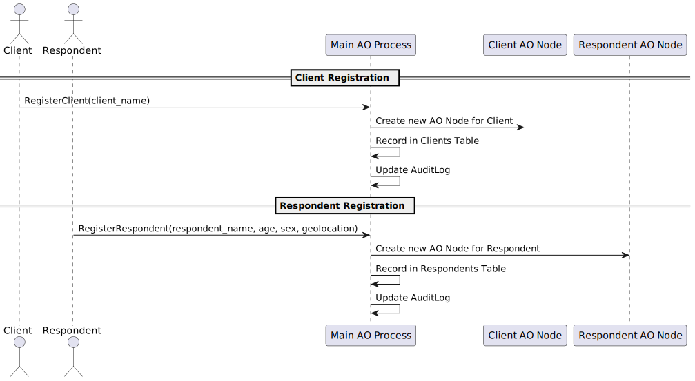

# eoc-survey-sync

**eoc-survey-sync** is a distributed survey management platform designed to leverage **Actor-Oriented (AO) processes** for scalable survey creation, management, and response collection. The platform provides **isolated client and respondent nodes**, advanced target group management capabilities, customizable surveys, and a **synchronized schema version control system** to ensure consistency and flexibility across distributed environments.

## Table of Contents
1. [Project Overview](#project-overview)
2. [Project Structure](#project-structure)
3. [Process API Descriptions](#process-api-descriptions)
    - [Main AO Process API](#main-ao-process-api)
    - [Client Node API](#client-node-api)
    - [Respondent Node API](#respondent-node-api)
4. [PlantUML Flow Diagrams](#plantuml-flow-diagrams)
5. [Installation and Usage](#installation-and-usage)
6. [Contributing](#contributing)
7. [License](#license)
8. [Final Thoughts](#final-thoughts)

## Project Overview

**eoc-survey-sync** provides:
- **Client AO Nodes**: Each client has its own compute/storage node, allowing independent survey creation and management.
- **Respondent AO Nodes**: Each respondent has an isolated node to manage survey participation and responses.
- **Main AO Process**: Acts as a central service layer for managing client and respondent nodes, schema management, and survey synchronization.

The system ensures that every **Client** and **Respondent Node** is consistently updated with the latest schema version and offers a way for each client to create targeted surveys using standardized **questions**, **categories**, and **answer options**.

## Project Structure

- **process/**: This folder contains all the **AO Lua APIs** used to define the behavior of the Main AO Process, Client Nodes, and Respondent Nodes.
  - **main_node_api.lua**: Lua script managing client/respondent registration, schema synchronization, centralized metadata, and target group filtering.
  - **client_node_api.lua**: Lua script that handles survey creation and management for the clients.
  - **respondent_node_api.lua**: Lua script that manages survey participation, responses, and holds answers to standardized questionnaires.

- **src/**: This folder will contain Node.js testing files for AO processes (described later).

## Process API Descriptions

### Main AO Process API (`main_node_api.lua`)

The **Main AO Process API** handles the registration of clients and respondents, maintains metadata, manages schema synchronization, and provides advanced target group filtering based on **standardized questionnaires**.

#### Key Functions:

1. **`InitDb()`**:
   - Initializes the schema for the Main AO Process.
   - Creates tables for **Clients**, **Respondents**, **Survey Metadata**, **Schema Management**, and **Standard Survey Elements** (such as categories, questions, and answer options).

2. **`RegisterClient(client_name)`**:
   - Registers a new client, creates a new **AO compute/storage node** for that client, and assigns a schema version.
   - Logs the registration in the `AuditLog` table.

3. **`RegisterRespondent(respondent_name, age, sex, geolocation)`**:
   - Registers a new respondent, creates an **AO node** for them, and initializes it with the latest schema.
   - Stores respondent metadata and provides the respondent with a standardized questionnaire to complete.
   - Logs the respondent's registration in the `AuditLog`.

4. **`UpdateSchemaVersion(schema_sql, description)`**:
   - Updates the schema version, records the new version in `SchemaManagement`, and propagates the change to all active nodes.
   - Ensures consistency across all **Client and Respondent AO Nodes**.

5. **`PropagateSchemaToNodes(schema_sql, schema_version)`**:
   - Applies schema updates to all existing **Client and Respondent Nodes**.
   - Logs success or failure for each propagation attempt in the `AuditLog`.

6. **`GetEligibleRespondentsForSurvey(survey_id)`**:
   - Matches respondents based on **predefined criteria** in the standardized questionnaire.
   - Queries each **Respondent Node** to find answers that match the requirements set by the **Client** for the survey.

### Client Node API (`client_node_api.lua`)

The **Client Node API** allows clients to create and manage surveys using standardized categories, questions, and answer options.

#### Key Functions:

1. **`InitDb(schema_sql)`**:
   - Initializes or updates the client node database with the provided schema SQL.
   - Used during initial setup and schema updates.

2. **`CreateSurvey(survey_data, target_criteria)`**:
   - Creates a new survey using the provided `survey_data` and **target criteria** based on **answers to standardized questions**.
   - Stores references to **categories**, **questions**, and **answer options** from the standardized pool in the **Main AO Process**.
   - Specifies the **advanced target criteria** that will be used to match respondents.

3. **`PublishSurvey(survey_id)`**:
   - Publishes a draft survey, making it available to eligible respondents based on **advanced target group logic**.
   - Updates the status of the survey in the `SurveyMetadata` table in the **Main AO Process**.

### Respondent Node API (`respondent_node_api.lua`)

The **Respondent Node API** enables respondents to answer standardized questionnaires and participate in surveys targeted to them.

#### Key Functions:

1. **`InitDb(schema_sql)`**:
   - Initializes or updates the respondent node database with the provided schema SQL.
   - Ensures consistency with the latest version of the schema.

2. **`AnswerStandardQuestionnaire(answers)`**:
   - Records the respondent's answers to the standardized questionnaire, storing them locally in the **Respondent Node**.
   - These answers are used by the **Main AO Process** to determine eligibility for surveys.

3. **`GetAvailableSurveys()`**:
   - Fetches a list of surveys for which the respondent is eligible, based on their answers to the standardized questions.
   - Filters surveys using the **target group criteria** set by the **Client**.

4. **`SubmitSurveyResponse(survey_id, responses)`**:
   - Records the respondent's answers in the `SurveyResponses` table.
   - Logs the response submission in the `AuditLog`.

## Advanced Target Group Logic

The **advanced target group** feature allows **Clients** to create surveys targeted at respondents based on their answers to a **standardized questionnaire**. This provides a powerful way to create **complex respondent matching** based on detailed information beyond simple demographics.

### Workflow for Advanced Target Group Filtering

1. **Standardized Questionnaire Setup**:
   - The **Main AO Process** maintains standardized **categories, questions, and answer options** that respondents answer when they first register.
   - These answers are stored in each **Respondent Node**.

2. **Client Defines Target Criteria**:
   - During **survey creation**, the **Client Node** defines advanced target group criteria based on **answers** to specific questions from the standardized questionnaire.
   - For example, a client may target respondents who answered "Yes" to "Do you own a car?" and are "between 25-34 years old."

3. **Survey Matching for Respondents**:
   - When a **Respondent Node** requests available surveys (`GetAvailableSurveys()`), the **Main AO Process** uses the predefined criteria to determine eligibility.
   - Each **Respondent Node**'s answers are compared with the **target group criteria** to find matching surveys.

4. **Respondent Receives Surveys**:
   - If the respondent's data matches the **target criteria** of a survey, that survey is included in the list of **available surveys**.

### Target Group Logic Implementation in Main AO Process API

- **`GetEligibleRespondentsForSurvey(survey_id)`**:
  - Fetches the criteria defined by the **Client** for the specified `survey_id`.
  - Queries each **Respondent Node** to check whether their **questionnaire answers** match the criteria.
  - Returns a list of **eligible respondents**.

## PlantUML Flow Diagrams

Below are **PlantUML** diagrams to illustrate the interactions between the **Main AO Process**, **Client Nodes**, and **Respondent Nodes**, including advanced targeting.

### 1. Registration Flow

### 2. Survey Creation and Publication

### 3. Advanced Target Group Definition and Matching

### 4. Respondent Survey Matching and Response Submission

### 5. Schema Update and Synchronization

## Installation and Usage
### Requirements
### Running the AO Processes
## Contributing
## License
This project is licensed under the Apache License Version 2.0

## Final Thoughts

The **eoc-survey-sync** platform is designed for environments that require complex survey management and targeting, offering features like distributed data handling, standardized survey creation, and advanced filtering mechanisms. Its scalable architecture supports large-scale deployments while ensuring privacy and individual node management.

