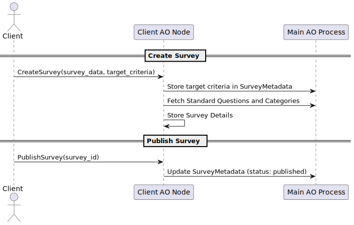
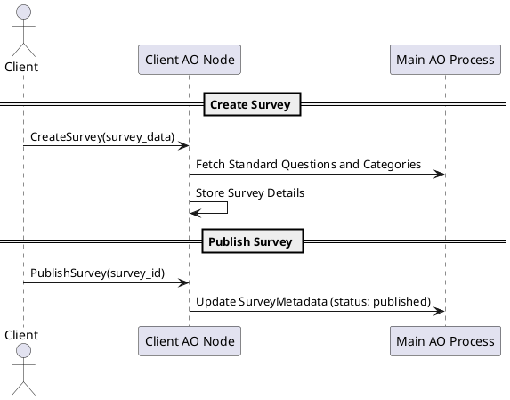

# eoc-survey-sync

**eoc-survey-sync** is a distributed survey management platform designed to leverage **Actor-Oriented (AO) processes** for scalable survey creation, management, and response collection. The platform provides **isolated client and respondent nodes**, advanced target group management capabilities, customizable surveys, and a **synchronized schema version control system** to ensure consistency and flexibility across distributed environments.

## Table of Contents
1. [Project Overview](#project-overview)
2. [Project Structure](#project-structure)
3. [Process API Descriptions](#process-api-descriptions)
    - [Main AO Process API](#main-ao-process-api)
    - [Client Node API](#client-node-api)
    - [Respondent Node API](#respondent-node-api)
4. [PlantUML Flow Diagrams](#plantuml-flow-diagrams)
5. [Installation and Usage](#installation-and-usage)
5. [Contributing](#contributing)
5. [License](#license)

## Project Overview

**eoc-survey-sync** provides:
- **Client AO Nodes**: Each client has its own compute/storage node, allowing independent survey creation and management.
- **Respondent AO Nodes**: Each respondent has an isolated node to manage survey participation and responses.
- **Main AO Process**: Acts as a central service layer for managing client and respondent nodes, schema management, and survey synchronization.

The system ensures that every **Client** and **Respondent Node** is consistently updated with the latest schema version and offers a way for each client to create targeted surveys using standardized **questions**, **categories**, and **answer options**.

## Project Structure

- **process/**: This folder contains all the **AO Lua APIs** used to define the behavior of the Main AO Process, Client Nodes, and Respondent Nodes.
  - **main_node_api.lua**: Lua script managing client/ respondent registration, schema synchronization, and centralized metadata.
  - **client_node_api.lua**: Lua script that handles survey creation and management for the clients.
  - **respondent_node_api.lua**: Lua script that manages survey participation and response storage for respondents.

- **src/**: This folder will contain Node.js testing files for AO processes (described later).

## Process API Descriptions

### Main AO Process API (`main_node_api.lua`)

The **Main AO Process API** handles the registration of clients and respondents, maintains metadata, and manages schema synchronization.

#### Key Functions:

1. **`InitDb()`**:
   - Initializes the schema for the Main AO Process.
   - Creates tables for **Clients**, **Respondents**, **Survey Metadata**, **Schema Management**, and **Standard Survey Elements**.

2. **`RegisterClient(client_name)`**:
   - Registers a new client, creates a new **AO compute/storage node** for that client, and assigns a schema version.
   - Logs the registration in the `AuditLog` table.

3. **`RegisterRespondent(respondent_name, age, sex, geolocation)`**:
   - Registers a new respondent, creates an **AO node** for them, and initializes it with the latest schema.
   - Logs the respondent's registration in the `AuditLog`.

4. **`UpdateSchemaVersion(schema_sql, description)`**:
   - Updates the schema version, records the new version in `SchemaManagement`, and propagates the change to all active nodes.
   - Ensures consistency across all **Client and Respondent AO Nodes**.

5. **`PropagateSchemaToNodes(schema_sql, schema_version)`**:
   - Applies schema updates to all existing **Client and Respondent Nodes**.
   - Logs success or failure for each propagation attempt in the `AuditLog`.

### Client Node API (`client_node_api.lua`)

The **Client Node API** allows clients to create and manage surveys using standardized categories, questions, and answer options.

#### Key Functions:

1. **`InitDb(schema_sql)`**:
   - Initializes or updates the client node database with the provided schema SQL.
   - Used during initial setup and schema updates.

2. **`CreateSurvey(survey_data)`**:
   - Creates a new survey using the provided `survey_data`.
   - Stores references to **categories**, **questions**, and **answer options** from the standardized pool in the **Main AO Process**.

3. **`PublishSurvey(survey_id)`**:
   - Publishes a draft survey, making it available to eligible respondents.
   - Updates the status of the survey in the `SurveyMetadata` table in the **Main AO Process**.

### Respondent Node API (`respondent_node_api.lua`)

The **Respondent Node API** enables respondents to answer surveys targeted to them based on demographic information.

#### Key Functions:

1. **`InitDb(schema_sql)`**:
   - Initializes or updates the respondent node database with the provided schema SQL.
   - Ensures consistency with the latest version of the schema.

2. **`GetAvailableSurveys()`**:
   - Fetches a list of surveys for which the respondent is eligible, based on their demographic data.

3. **`SubmitSurveyResponse(survey_id, responses)`**:
   - Records the respondent's answers in the `SurveyResponses` table.
   - Logs the response submission in the `AuditLog`.

## PlantUML Flow Diagrams

Below are **PlantUML** diagrams to illustrate the interactions between the **Main AO Process**, **Client Nodes**, and **Respondent Nodes**.

### 1. Registration Flow

### 2. Survey Creation and Publication

### 3. Schema Update and Synchronization

## Installation and Usage
### Requirements
### Running the AO Processes
## Contributing
## License
This project is licensed under the Apache License Version 2.0
### Summary:

- The **README.md** file provides a comprehensive overview of the project, describing the purpose, structure, and API functions of each AO process.
- **Main AO Process API**: Manages the central orchestration, including schema management and client/respondent registration.
- **Client Node API**: Focused on survey creation and publication.
- **Respondent Node API**: Manages survey participation and stores responses.
- **PlantUML diagrams** illustrate the key interactions between the **Main AO Process**, **Client AO Nodes**, and **Respondent AO Nodes** to provide a visual representation of workflows like **registration**, **survey creation**, and **schema synchronization**.

Feel free to provide more details on the `src` folder, and I can incorporate that into the README or further documentation as needed.
